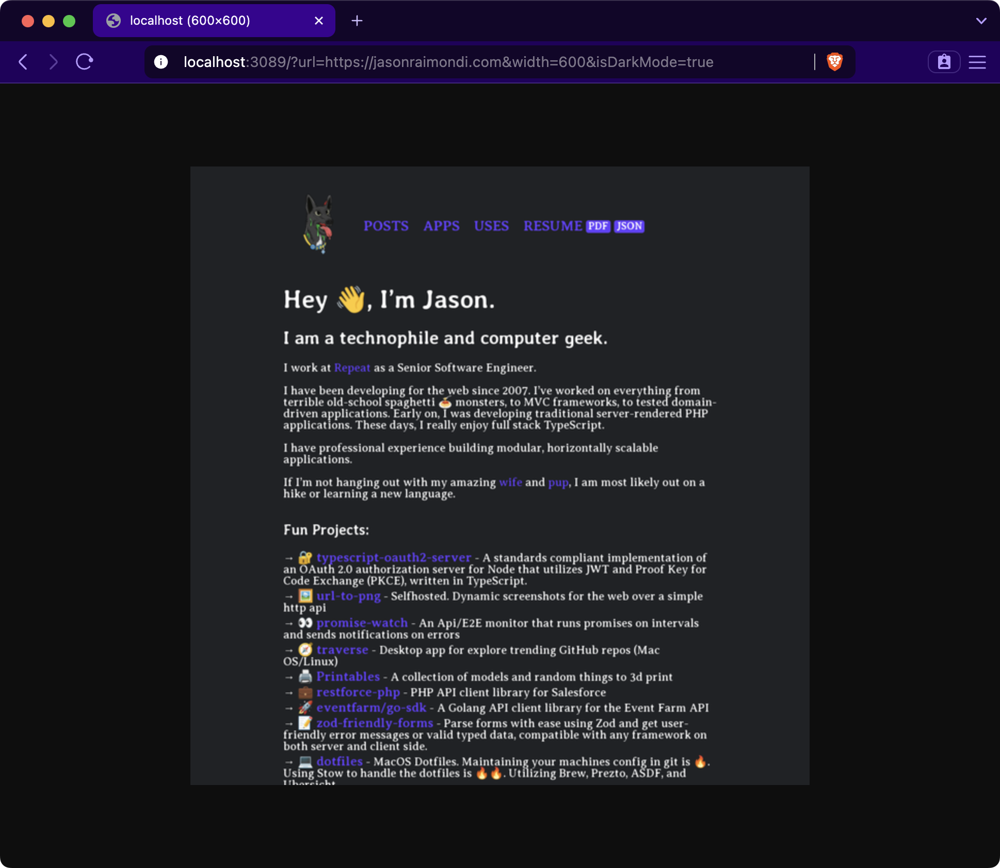
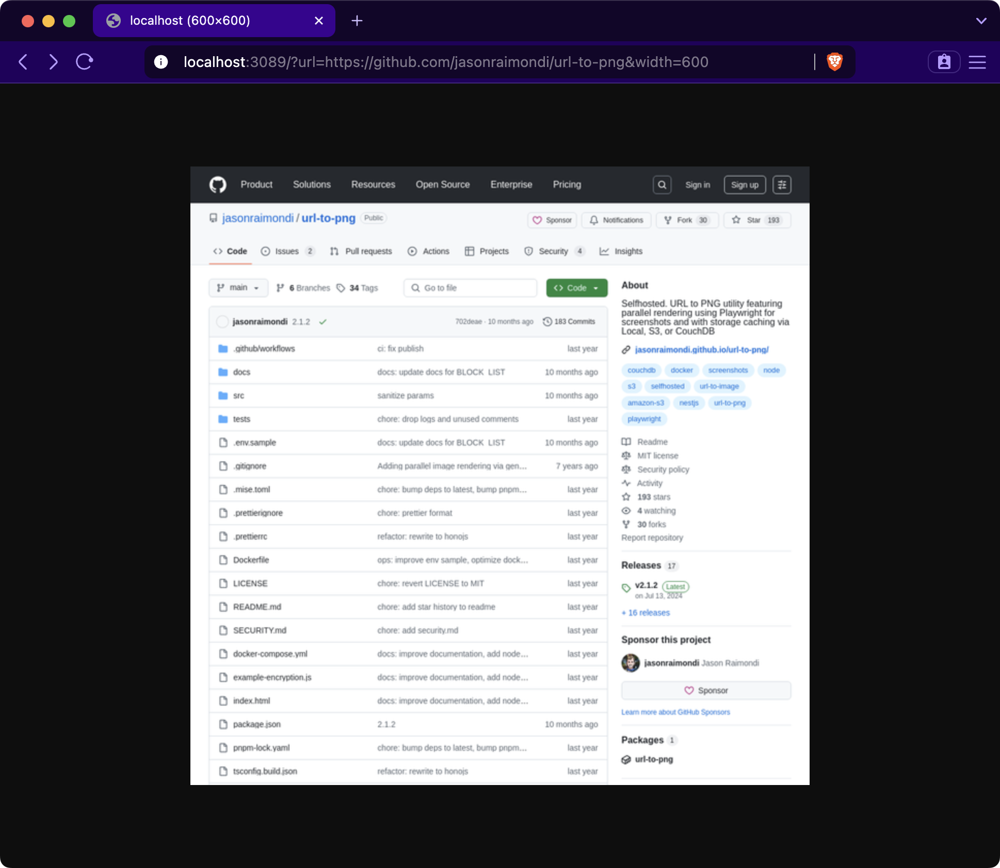

<h1 align="center">
  	
  	<br /> URL to PNG
</h1>

[](https://github.com/jasonraimondi/url-to-png/blob/main/LICENSE)
[](https://github.com/jasonraimondi/url-to-png)
[](https://hub.docker.com/r/jasonraimondi/url-to-png/tags)


A URL to PNG generator over HTTP with a fairly simple API accessed via query params passed to the server.

- Generate PNG images from URLs
- Customizable image dimensions and viewport size
- Support for mobile user agent and dark mode rendering
- Caching of generated images
- Allow list for domain-specific requests
- Configurable Playwright options
- Integration with various storage providers (AWS S3, CouchDB, Filesystem)
- Prometheus metrics endpoint

## Examples

<table>
  <tr>
    <td></td>
    <td></td>
  </tr>
</table>

Use in your HTML

```html


```

## Getting Started

Checkout [the docs to getting_started](https://jasonraimondi.github.io/url-to-png/getting_started/)

### Docker

Run the following command:

```
docker run --rm -p 3089:3089 ghcr.io/jasonraimondi/url-to-png
```

On the hub: [Link to DockerHub](https://hub.docker.com/r/jasonraimondi/url-to-png/)

### Local Serve

Serve the project

```
git clone https://github.com/jasonraimondi/url-to-png
cd url-to-png
pnpm install
pnpm exec playwright install chromium
pnpm dev
```

## Configuration

Read the [full config options](https://jasonraimondi.github.io/url-to-png/config/)

## Encryption

Learn about [encryption](https://jasonraimondi.github.io/url-to-png/encryption/)

## Metrics

Learn about [metrics](https://jasonraimondi.github.io/url-to-png/metrics/)

## Star History

[](https://star-history.com/#jasonraimondi/url-to-png&Timeline)
